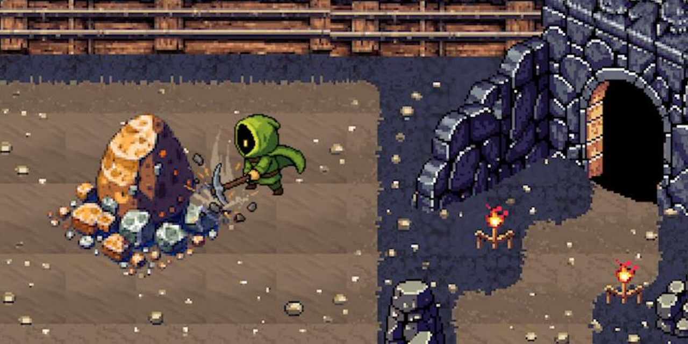
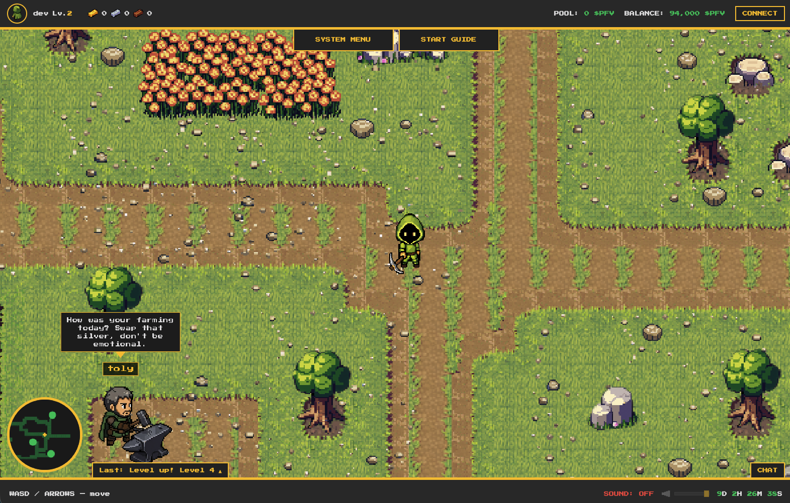
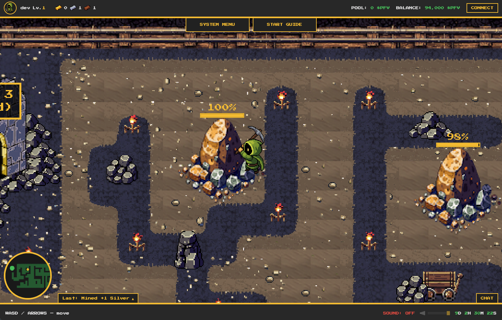
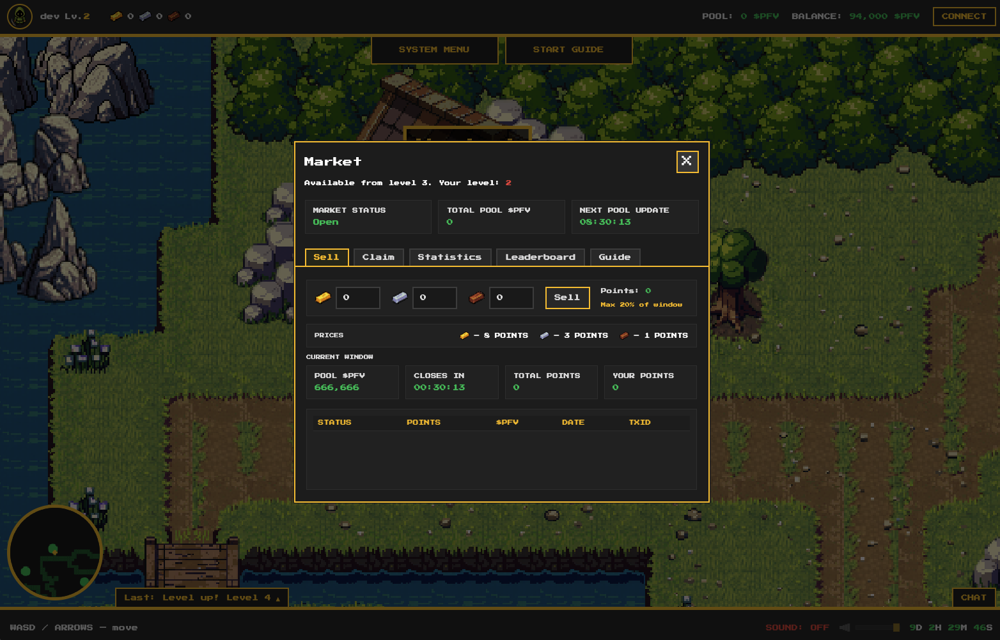
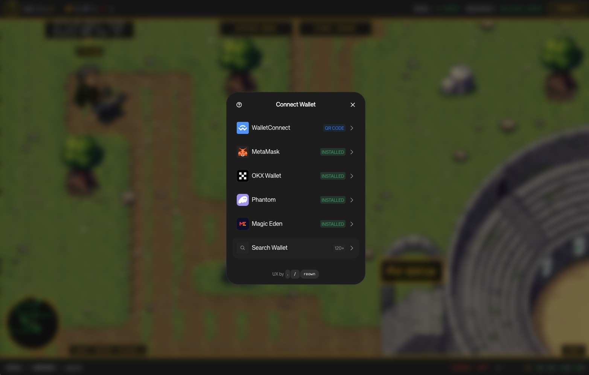
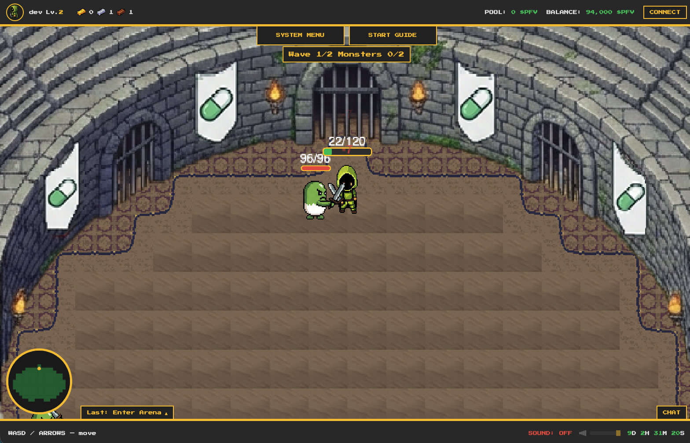

# Pixel Farm Valley — Solana Hackathon

<p align="center">
  
</p>

<p align="center">
  <strong>Play-to-Earn game on Solana</strong><br />
  Mine resources • Trade in the market • Claim $PFV to your wallet
</p>

<p align="center">
  <a href="https://pixelvalley.farm">Live Demo</a> •
  <a href="#quick-start">Quick Start</a> •
  <a href="#tech-stack">Tech Stack</a> •
  <a href="docs/HACKATHON.md">Hackathon Guide</a> •
  <a href="CONTRIBUTING.md">Contributing</a>
</p>

---

## Overview

**Pixel Farm Valley** is a resource-driven Play-to-Earn game built on Solana. Players mine gold, silver, and bronze in the mine, sell them for points in the market, and withdraw $PFV tokens to their Solana wallet.

This repository contains the **frontend only** — the game client that connects to the public Pixel Valley Farm API. No backend code is included; the app runs against the production API by default.

### Why it matters

- **Player-driven economy** — Mine raw materials, sell at market, claim $PFV to your wallet
- **End-to-end flow** — In-game actions → points → token withdrawal to Solana
- **Trust design** — Burn mechanics and certificates to reduce fraud and sybil attacks

## Quick Start

```bash
# Install dependencies
pnpm install
# or: npm install

# Create .env from example (see Environment Variables)
cp .env.example .env

# Start dev server
pnpm dev
# or: npm run dev
```

Open [http://localhost:5173](http://localhost:5173) in your browser.

## Environment Variables

| Variable | Description | Required |
|----------|-------------|----------|
| `VITE_API_URL` | API base URL. Default: `https://pixelvalley.farm` (empty = same origin) | No |
| `VITE_WALLETCONNECT_PROJECT_ID` | [Reown AppKit](https://cloud.reown.com) project ID for wallet connect | **Yes** (for wallet features) |
| `VITE_REDIRECT_LAUNCH_TO_LIVE` | When `true`, LAUNCH GAME redirects to pixelvalley.farm (for landing-only deploy) | No |

Create a `.env` file:

```env
VITE_API_URL=https://pixelvalley.farm
VITE_WALLETCONNECT_PROJECT_ID=your_project_id_here
```

Get a WalletConnect project ID at [cloud.reown.com](https://cloud.reown.com).

## Tech Stack

| Layer | Technology |
|-------|------------|
| Game engine | Phaser 3 |
| Frontend | Vite, TypeScript |
| Blockchain | Solana (Web3.js), WalletConnect (Reown AppKit) |
| Styling | CSS, Press Start 2P font |

## Features

- **Mining** — Enter the mine, collect gold, silver, bronze
- **Market** — Sell resources for points, claim $PFV to balance
- **Wallet** — Connect Phantom, Solflare, or 500+ wallets via WalletConnect
- **Arena** — PvE battles for extra rewards
- **Referrals** — Invite friends, earn bonuses

## Screenshots

| Valley | Mine | Market |
|--------|------|--------|
|  |  |  |

| Wallet | Arena |
|--------|-------|
|  |  |

## Project Structure

```
├── index.html          # Entry HTML
├── src/
│   ├── main.ts         # App bootstrap
│   ├── gameBoot.ts     # Phaser game init
│   ├── arena/          # Arena scenes
│   └── *.ts            # UI windows, API, wallet
├── public/             # Static assets (maps, sprites, sounds)
├── docs/HACKATHON.md   # Hackathon setup guide
└── package.json
```

## Build

```bash
pnpm build
# Output: dist/
```

**How to verify:**
- **Deploy Preview (Vercel URL)** — Landing page; LAUNCH button redirects to [pixelvalley.farm](https://pixelvalley.farm)
- **Local** — `pnpm dev` — full client at [localhost:5173](http://localhost:5173)

**Landing-only deploy (Vercel, GitHub Pages, etc.):** when hosting on a different domain, login won't work (API CORS, OAuth redirects). Use `build:landing` so LAUNCH GAME redirects to the live game:

```bash
pnpm build:landing
```

> **Vercel:** this repo includes `vercel.json` with `buildCommand: pnpm build:landing` — LAUNCH will redirect to pixelvalley.farm automatically.

Preview production build:

```bash
pnpm preview
```

## Links

- **Live game:** [pixelvalley.farm](https://pixelvalley.farm)
- **Solana:** [solana.com](https://solana.com)
- **Reown AppKit:** [docs.reown.com/appkit](https://docs.reown.com/appkit/javascript/core/options)
- **Phaser:** [phaser.io](https://phaser.io)

## License

MIT
